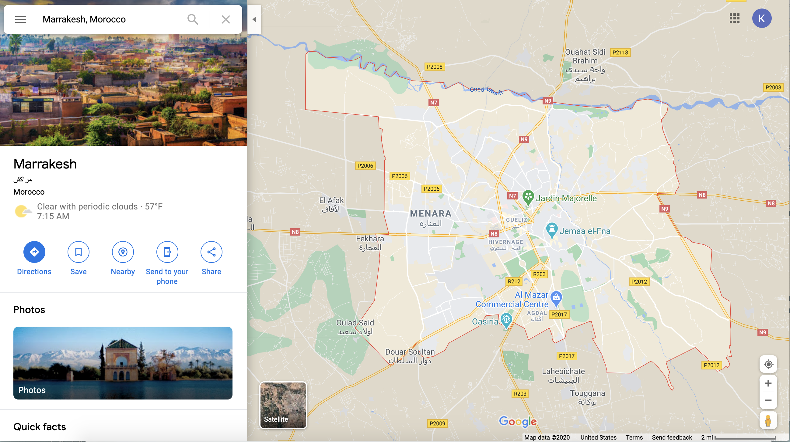
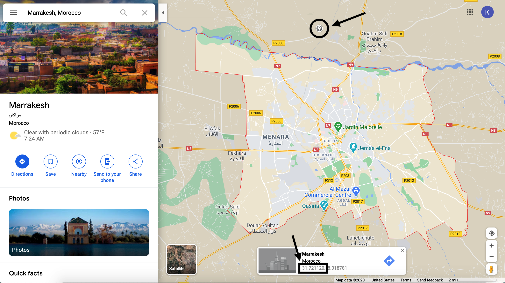
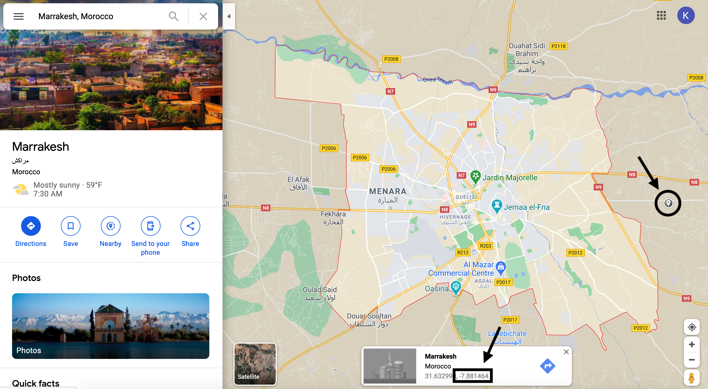

```{r opts, include = FALSE}
knitr::opts_chunk$set(
  collapse = TRUE,
  comment = "#>"
)
```


The global dataset is helpful except when you aren't interested in dealing with global data. Often times, users have a specific area of interest in mind. The `filter_by_quadkey()` function is one way of dealing with this issue. The function takes a set of tiles (from `get_performance_tiles()`) and a bounding box (from `st_bbox()`) and returns just the tiles within the set bounding box. There are two main ways of setting this box: a shapefile or manually input coordinates.

```{r setup}
library(ooklaOpenDataR)
library(sf)
library(mapview) # check our tiles
```

## Filter tiles by manual coordinates

Choosing coordinates from somewhere like Google maps is flexible and quick, but not necessarily reproducible or sustainable. When you don't have a boundary shapefile, though, it's a good alternative. We'll see how to do this with Google maps, but any source where you can find coordinates would work.

Let's say you're interested in the fixed broadband performance around Marrakesh, Morocco but don't have a shapefile of the boundary on hand. We can still approximate it!

Type in the place in the search bar: `Marrakesh, Morocco`

```{r search, echo = FALSE, out.width="500px"}

```

Once you have the area highlighted, you can start choosing coordinates. We'll start at the top to get the `ymax` coordinate. You want to pick a point that's at least includes the northernmost edge of your area.

```{r marrakesh_top, echo = FALSE, out.width="500px"}

```

I usually round my coordinates for simplicity so we'll say `ymax = 31.72`.

Next we'll repeat the process and click on the rightmost point to get the `xmax` coordinate.

```{r marrakesh_right, echo = FALSE, out.width="500px"}

```

Based on this point we'll say `xmax = -7.88`. Repeat this process again for the bottom (`ymin`) and leftmost (`xmin`) coordinates. 

Once you've gathered all the coordinates, you can create the bounding box with the following code:

```{r bbox}
bbox <- st_bbox(c(xmin = -8.13, xmax = -7.88, ymax =31.72, ymin = 31.55), crs = st_crs(4326)) # 4326 means that the coordinates are latitude and longitude
```

Pull the global dataset for fixed data in Q2 2020 and filter with the `bbox` object.

```{r marrakesh_tiles, results = 'hide'}
marrakesh_fixed_tiles <- get_performance_tiles(service = "fixed", year = 2020, quarter = 2, sf = TRUE) %>%
  filter_by_quadkey(bbox = bbox)
```

Then to check that the tiles are in the right place we'll use `mapview()` to make a quick interactive map with a basemap.

```{r mapview_marrakesh}
mapview(marrakesh_fixed_tiles)
```

Success!

## Filter tiles by shapefile

If you do have a shapefile (or other geographic data file, geoJSON for example), the process is much simpler. We'll use Minneapolis, MN as an example here.

The city's open data portal has a boundary file we can use for filtering the tiles. 

```{r mpls}
minneapolis <- read_sf("https://opendata.arcgis.com/datasets/89f1a70c0cf24d7692e2d02fdf8f4e47_0.geojson") %>%
  st_transform(4326) # transform to lat/lon
```

Then we'll download the fixed performance tiles for Q2 2020 and filter them with the Minneapolis boundary. 

```{r mpls_fixed_tiles, results = 'hide'}
mpls_fixed_tiles <- get_performance_tiles(service = "fixed", year = 2020, quarter = 2, sf = TRUE) %>%
  filter_by_quadkey(bbox = st_bbox(minneapolis))
```

Check to make sure it looks right:

```{r mapview_mpls}
mapview(mpls_fixed_tiles)
```

Success!
